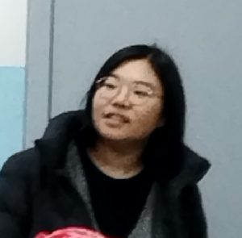

  
  
YangCun No.8 Middle School Terrier Collection

  
杨村第八中学梗图合集

> **Declaration: This content is for testing and entertainment purposes only. Anyone can copy and download it, but it is not allowed to use the memes in inappropriate places. If you are the protagonist or creator of the picture and think that the picture violates your rights, please check our contact information and contact us at any time.**

# Welcome to View the Meme Collection of Yangcun No. 8 Middle School

## Project Introduction
This project collects and creates memes related to Yangcun No. 8 Middle School, aiming to reflect campus life and culture in a humorous way. Some content has not been authorized. If you think that the pictures violate your rights, please check our contact information and contact us at any time. If you allow us to use them, please also check our contact information and contact us. This is only for entertainment and learning communication purposes.

Pictures of many teachers are cited. If you are not satisfied with the content of the pictures, please contact us at any time.

## Copyright Statement
1. **Copyright Ownership**
All original content of this project (including but not limited to pictures, texts, designs, etc.) is copyrighted by the creator. Without permission, no one may use the content of this project for commercial purposes.
For non-original content, this project has made every effort to mark the source and follow the relevant copyright agreements; however, due to source reasons, there are still third-party pictures that cannot be marked with the source. If there are omissions or infringements, please contact us for handling.

2. **Third-Party Content**
The third-party content may not have the source marked, but its copyright still belongs to the original author, and some are only reprinted.

3. **MIT License**
This project is released under the MIT license. You can freely use, modify, and distribute the content of this project, but you need to retain the original copyright notice and license statement in the copy.

## Usage Terms
1. **Scope of Application**
All content of this project is for personal entertainment and non-commercial purposes only. Any commercial use requires written authorization from the creator.
For the third-party content of this project, you need to seek the commercial permission from the original author. If it involves the handling of the right of portraiture, written authorization from the photographed person is required before it can be used for commercial purposes. The photographed person, the original author, and the name of this project need to be marked in the commercial work.

2. **Prohibited Acts**
- It is prohibited to use the content of this project for any illegal, slanderous, insulting, or defamatory purposes that damage the reputation of others.
- It is prohibited to maliciously tamper with the content of this project, especially the part involving the reputation of Yangcun No. 8 Middle School and its teachers and students.
- It is prohibited to use the content of this project for propaganda in political, religious, or other sensitive fields.
- It is prohibited to maliciously misinterpret the purpose and intention of this project.
- It is prohibited to abuse the photographed person in the pictures of the project. Even if the pictures are funny, we should laugh at the memes, not the people.

3. **User Liability**
Users shall bear the possible legal risks when using the content of this project. The creator of this project shall not be liable for any liability arising from the improper use of the content by users.

## Disclaimer
1. **Authenticity of Content**
The content of the memes in this project is partially fictional or exaggerated, and does not represent the real situation of Yangcun No. 8 Middle School. Please do not use the content of this project as a basis for facts. Any content of this project shall not be used as evidence.

2. **Protection of Reputation Rights**
This project respects the reputation rights of Yangcun No. 8 Middle School and its teachers and students. If there is any content involving specific individuals or events, it is an unintentional act. Please contact us to delete it.

3. **Legal Liability**
The creator of this project shall not be liable for any legal disputes arising from the use of the content of this project. Users need to ensure that their use behavior complies with relevant laws and regulations.

## Acknowledgments and Apologies
1. **For Classmates**
Thank you very much for being willing to provide photos or allowing us to collect and summarize the pictures here. We are very grateful for your contribution to this project. If you hate anyone's infringement of your right of portraiture or refuse us to use your portrait, please contact us quickly, and we will delete the inappropriate pictures you think of as soon as possible.

2. **For Teachers**
Thank you very much for being willing to provide photos or allowing us to collect and summarize the pictures here. We are very grateful for your contribution to this project and your support for this project. We believe that you have a young mentality and will not refuse us to use your memes privately. If you refuse us to use your portrait, please contact us quickly, and we will delete the inappropriate pictures you think of as soon as possible.

3. **For Everyone**
Thank you all very much for your support for this project. This project started on March 24, 2025, and will last for a long time. During this period, we call on everyone to actively contribute and enrich the cultural life of Yangcun No. 8 Middle School [Doge]

## Contribution Guidelines
1. **Submission Requirements**
You are welcome to submit memes related to Yangcun No. 8 Middle School. The submitted content needs to meet the following requirements:
- Original or legally authorized.
- Does not involve illegal, slanderous, insulting, or defamatory content that damages the reputation of others.
- Mark the source (if applicable).

2. **Submission Method**
Please submit your submissions through the Pull Request function on GitHub. We will decide whether to merge it into the project after review. Or send some pictures in the "Eighth Grade Happy Group", or send a private message to "GVSDS - WYT"

## Contact Information
If you have any questions or suggestions, please contact us:
- Email: wyt18222152539wyt@163.com
- Studio Official Website: https://www.gvsds.com
- GitHub Issues: https://github.com/GVSADS/EMSTC/issues

## Appendix
1. **Related Laws and Regulations**
- Copyright Law of the People's Republic of China
- Law of the People's Republic of China on the Protection of the Right of Reputation
- Regulations on the Protection of the Right to Network Dissemination of Information

2. **Reference Materials**
- [Legal Risks of Copyright of Open Source Software](https://www.sohu.com/a/223894107_221481)
- [MIT License Usage Guide](https://www.zhihu.com/question/39467487) 
- [Legal Risks of the Use of the Name of Educational Institutions](https://www.lawyers.org.cn/info/8765cd91dc6f4d6a9e1e925e76cf3fa3)

---
> **声明：本内容仅供测试和娱乐，任何人都可以复制和下载，但是不允许在不恰当的地方使用梗图，如果您是图片的主角或制作者，认为图片侵犯了您的权力，请随时查看我们的联系方式并与我们联系**

# 欢迎查看杨村八中梗图合集

## 项目简介
本项目收集并创作了与杨村第八中学相关的梗图，旨在以幽默的方式反映校园生活和文化。部分内容未获得授权，如果您认为图片侵犯了您的权力，请随时查看我们的联系方式并与我们联系，如果您允许我们使用，也请您请随时查看我们的联系方式并与我们联系，仅供娱乐和学习交流使用。

引用诸多老师的照片，如果您对于照片的内容不满意，请随时与我们联系。

## 版权声明
1. **版权归属**  
   本项目的所有原创内容（包括但不限于图片、文字、设计等）版权归创作者所有。未经许可，任何人不得将本项目内容用于商业用途。  
   对于非原创内容，本项目已尽力标注来源，并遵循相关版权协议；但由于来源原因，仍然有第三方图片无法标明出处如有遗漏或侵权，请联系我们处理。

2. **第三方内容**  
   第三方内容可能没有标明出处，但其著作权依旧属于原作者，部分仅作转载。

3. **MIT 协议**  
   本项目采用 MIT 协议发布。你可以自由使用、修改和分发本项目的内容，但需在副本中保留原版权声明和许可声明。

## 使用条款
1. **适用范围**  
   本项目的所有内容仅供个人娱乐和非商业用途。任何商业使用均需获得创作者的书面授权。
   本项目的第三方内容需寻找原作者商业请求，如果设计肖像权处理需经被拍摄人书面授权才可作为商业用途，在商业作品中需标出被拍摄人、原作者和本项目名称。

2. **禁止行为**  
   - 禁止将本项目内容用于任何违法、诽谤、侮辱或损害他人名誉的用途。
   - 禁止恶意篡改本项目内容，尤其是涉及杨村第八中学及其师生名誉的部分。
   - 禁止将本项目内容用于政治、宗教或其他敏感领域的宣传。
   - 禁止恶意解读本项目的目的和意图。
   - 禁止对项目内图片被拍摄人辱骂等，即使图片搞笑，笑图不笑人。

3. **用户责任**  
   用户在使用本项目内容时，需自行承担可能产生的法律风险。本项目创作者不承担因用户不当使用内容而引发的任何责任。

## 免责声明
1. **内容真实性**  
   本项目中的梗图内容部分虚构或夸张创作，不代表杨村第八中学的真实情况。请勿将本项目内容作为事实依据。本项目任何内容不作为证据使用。

2. **名誉权保护**  
   本项目尊重杨村第八中学及其师生的名誉权。如有内容涉及具体个人或事件，均为无意之举，请联系我们删除。

3. **法律责任**  
   本项目创作者不对因使用本项目内容而引发的任何法律纠纷负责。用户需自行确保其使用行为符合相关法律法规。

## 致谢和道歉
1. **对于同学**  
   非常感谢您愿意提供照片或允许我们收集图片并总结在这里，我们十分感谢您对本项目做出的贡献，如果您很讨厌有人侵犯您的肖像权或拒绝我们使用您的肖像，请迅速与我们取得联系，我们会以最快的速度删除您所认为不恰当的图片。

2. **对于老师**  
   非常感谢您愿意提供照片或允许我们收集图片并总结在这里，我们十分感谢您对本项目做出的贡献和对于本项目的支持性，我们相信您具有年轻的心态，不会拒绝我们私下使用您的梗图，如果您拒绝我们使用您的肖像，请迅速与我们取得联系，我们会以最快的速度删除您所认为不恰当的图片。

3. **对于每个人**  
   十分感谢大家对于本项目的支持，本项目开始于2025/3/24号，并且将持续很长一段时间，在此期间内，我们呼吁大家积极投稿，丰富杨村八中的文化生活[Doge]

## 贡献指南
1. **投稿要求**  
   欢迎投稿与杨村第八中学相关的梗图。投稿内容需符合以下要求：
   - 原创或已获得合法授权。
   - 不涉及违法、诽谤、侮辱或损害他人名誉的内容。
   - 标注来源（如适用）。

2. **投稿方式**  
   请通过 GitHub 的 Pull Request 功能提交投稿。我们将在审核后决定是否合并到项目中。或通过在"八年级快乐群"中发送一些图片，亦或私信"GVSDS - WYT"

## 联系方式
如有任何问题或建议，请联系我们：  
- 邮箱：wyt18222152539wyt@163.com  
- 工作室官网 https://www.gvsds.com
- GitHub Issues：https://github.com/GVSADS/EMSTC/issues  

## 附录
1. **相关法律法规**  
   - 《中华人民共和国著作权法》  
   - 《中华人民共和国名誉权保护法》  
   - 《信息网络传播权保护条例》

2. **参考资料**  
   - [开源软件的著作权法律风险](https://www.sohu.com/a/223894107_221481)
   - [MIT 协议使用指南](https://www.zhihu.com/question/39467487) 
   - [教育机构名称使用法律风险](https://www.lawyers.org.cn/info/8765cd91dc6f4d6a9e1e925e76cf3fa3)